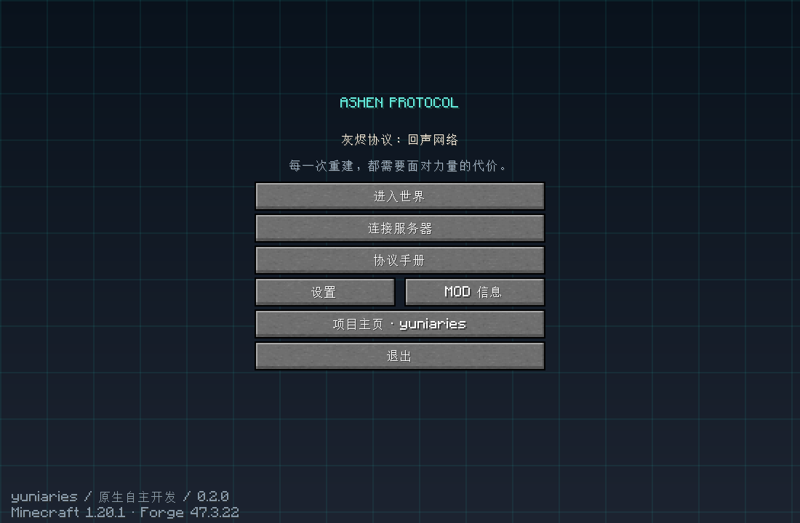
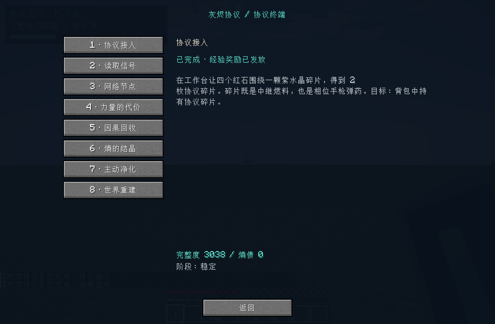

# 灰烬协议：回声网络

由 **yuniaries** 开发的 Minecraft 1.20.1 / Forge 47.3.22 原生玩法项目，Java 17。

项目主页：<https://github.com/yuniaries/AshenProtocol>。PCL 安装 ZIP 位于 [Releases](https://github.com/yuniaries/AshenProtocol/releases)。下载文件名中带“拖入PCL”的完整 ZIP，拖入启动器并安装为新版本。首次安装需联网下载 Minecraft、Forge 和运行库；自研 MOD 已内置。建议分配 3–4 GB 内存。



## 玩法

从普通生存寻找紫水晶和红石开始，走完八章进度：协议碎片、熵表、中继网络、相位手枪、死亡回声、熵晶体、主动净化、世界重建。每章完成后自动记录并只奖励一次经验；任务保存在玩家死亡后保留的数据中。

进入世界获得野外手册；右键手册或按 **P** 打开自研协议终端，查看配方说明、任务和服务器同步的世界状态。手持熵表时显示 HUD。主菜单、任务界面、像素纹理与玩法系统均由本项目实现。

- **相位手枪**：32 格射程，8 点伤害；每枪消耗一枚碎片、1 耐久，增加 2 点熵债；墙壁阻挡射线，冷却 8 tick。
- **协议中继**：碎片右键充能，每枚维持 200 秒；接通红石信号后每 5 秒完整度 +1、熵债 -1。只在加载的区块中运行，可并联多个中继。
- **因果回声**：死亡记录最近地点，重生后回到同一维度的 8 格范围内回收残渣。残渣可回收为 4 枚碎片；普通掉落物仍遵循 Minecraft 的规则。
- **熵债净化器**：消耗一枚熵晶体，熵债 -250、完整度 +10；冷却 5 秒。无熵债时不扣材料或耐久。
- **世界重建**：完成一次主动净化，完整度达到 3000 且熵债低于 1000，即完成最后一章；此后可继续生存。
- 高熵会导致短暂黑暗、协议残影和视觉闪电。`/protocol status` 不需要作弊，修改状态的管理命令需要权限。



## 自主开发与依赖

这个版本不继承落幕曲的 MOD 清单、任务、菜单、枪包、资源、素材、存档或作者链接。早期 0.1.x 衍生试验包不属于此仓库，也不能与当前版本混装。

核心实现根据用户提供的《灰烬协议 Standalone》设计文档开发和重构。仅依赖 Minecraft 与 Forge；第三方辅助 MOD 可以另行评估添加，但不承担本项目的核心玩法。不能把基础框架和 Minecraft 原版代码声明为自己的作品，详细来源见 [docs/PROVENANCE.md](docs/PROVENANCE.md)。

当前 0.2.0 是完整的核心玩法版本，未复刻旧整合包中第三方 MOD 的庞大内容。包的体积取决于实际自研内容，没有人为填充。

## 构建与验证

```bash
# Linux/macOS；Windows 使用 gradlew.bat
python3 tools/generate_assets.py
./gradlew build
python3 tools/package.py
```

产物位于 `build/libs/` 和 `build/release/`。`tools/package.py` 检查 Java 17 字节码、资源 JSON、作者链接、依赖、ZIP 完整性与内置 JAR；不会复制工作目录的其他整合包。

运行真实 Forge 服务端探针：

```bash
./gradlew clean build -PruntimeProbe
# 仅用于专门的临时测试服务器，切勿放进生产存档
# 把生成 JAR 放入安装好的 Forge 47.3.22 测试服务器 mods 目录
# 在该服务器目录运行（已接受 Minecraft EULA）
java -Xmx2G -Dashenprotocol.runtimeProbe=true @libraries/net/minecraftforge/forge/1.20.1-47.3.22/unix_args.txt --nogui
# 完成后重新构建发布 JAR，移除探针代码
./gradlew clean build
python3 tools/package.py
```

探针实际验证配方、射击伤害、弹药、墙壁遮挡、冷却、中继充能和脉冲、回声、世界 NBT、净化器与任务奖励。客户端另行验证主菜单、终端、HUD 和单人世界；详情见 [docs/VALIDATION.md](docs/VALIDATION.md)。

## 许可

项目原创代码与生成素材采用 MIT，作者 yuniaries。Minecraft、Forge、Gradle Wrapper 各自遵循原许可，不包含 Minecraft 本体。
